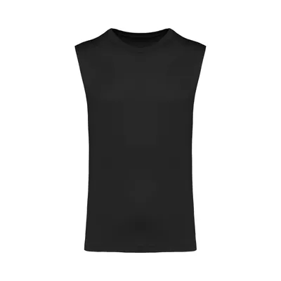
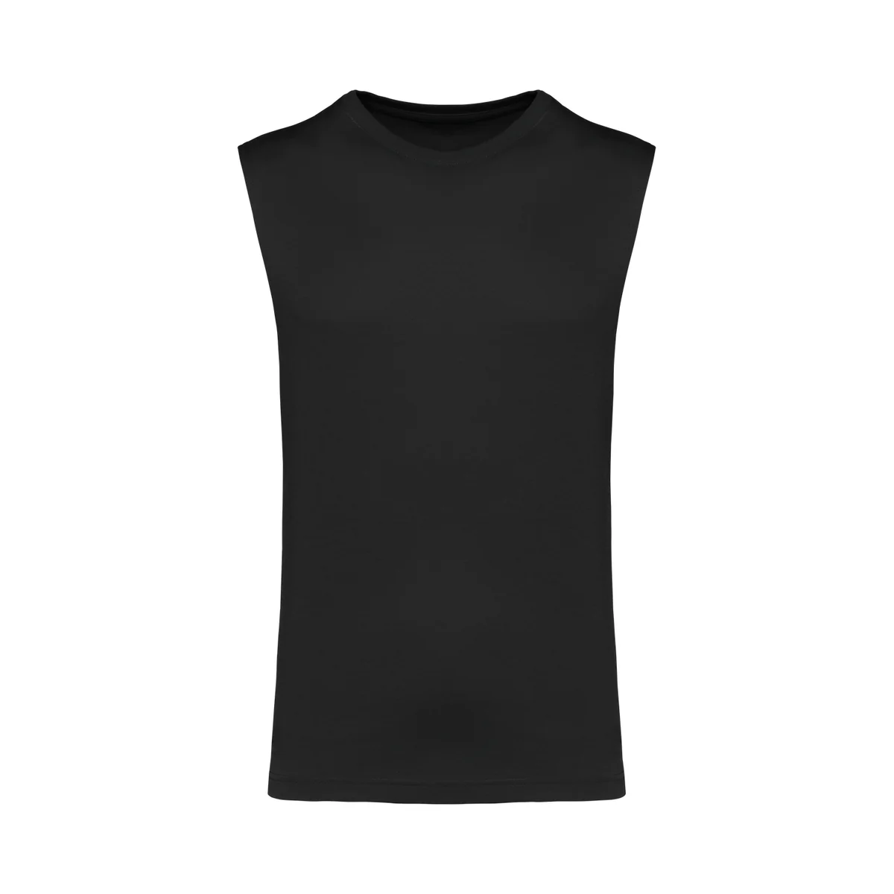
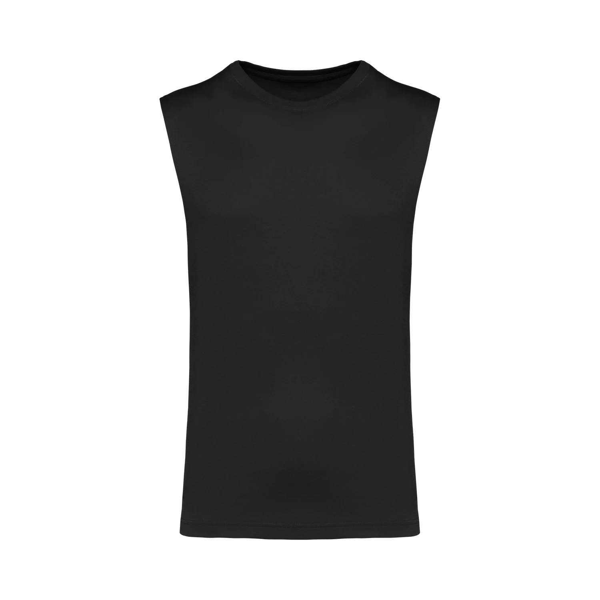

# Format des images mockup fournisseur

Toutes les images ont été converties en **WebP** (29 avril 2026).
Le format WebP offre une compression 10x à 50x meilleure que PNG/JPG pour des photos, avec une qualité visuelle quasi identique.

## Trois tailles disponibles par image

Pour chaque produit/couleur/vue, trois fichiers sont générés :

| Suffixe              | Taille max | Usage recommandé                          | Poids moyen |
|----------------------|------------|-------------------------------------------|-------------|
| `nom.thumb.webp`     | 400 px     | Vignettes, listes produits, grilles       | ~3.7 KB     |
| `nom.medium.webp`    | 1200 px    | Vue détail standard, cartes produit       | ~25 KB      |
| `nom.webp`           | 2000 px    | Zoom haute résolution, page produit fullscreen | ~66 KB |

## Stratégie d'intégration côté logiciel

```javascript
// Liste produits → utilise thumb (chargement instantané)


// Carte / vue détail → utilise medium


// Zoom / pleine résolution → utilise full

```

Astuce : utiliser l'attribut `srcset` HTML pour que le navigateur choisisse automatiquement la bonne taille selon le device.

## Bilan de la conversion

- 1494 images PNG/JPG converties (1.9 Go)
- 4494 fichiers WebP générés (142 Mo)
- Réduction : **−92.5 %**
- Qualité WebP : 88 (full) / 85 (medium) / 80 (thumb)

## Pourquoi pas du SVG ?

Le SVG est conçu pour des dessins vectoriels (logos, icônes). Pour des photos de mockups vêtements (avec ombres, dégradés, textures), un SVG vectorisé donnerait soit un rendu cartoon de mauvaise qualité, soit un fichier de plusieurs Mo par image — donc plus lourd qu'un PNG. WebP est le bon choix pour ce type de contenu.
